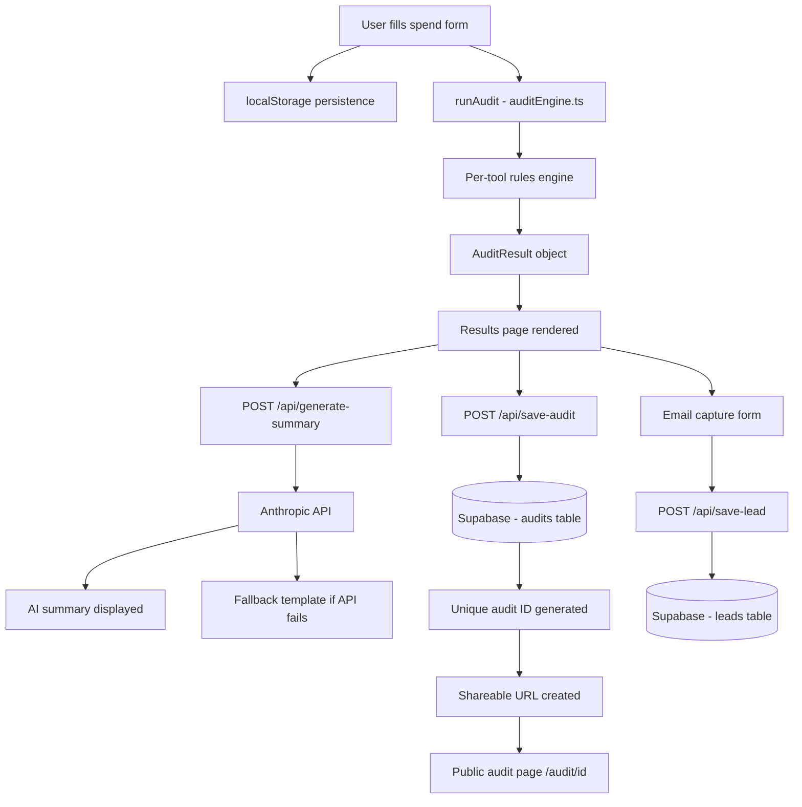

# Architecture

## System Diagram

## Data Flow

1. User inputs tools, plans, seats, team size, use case into the form
2. Form state persists to localStorage on every change
3. On submit, `runAudit(formData)` runs entirely client-side — no API call needed for the core audit
4. Audit result is passed to the results page component
5. Two parallel API calls fire: save audit to Supabase, generate AI summary via Anthropic
6. Supabase returns a UUID which becomes the shareable URL
7. User optionally submits email which saves to leads table

## Why I chose this stack

- **Next.js 14** — App Router handles both frontend and API routes in one codebase. No separate backend needed.
- **TypeScript** — Type safety on the audit engine prevents logical errors in savings calculations
- **Tailwind CSS** — Fast styling without context switching
- **Supabase** — Free tier, instant setup, Postgres under the hood, good TypeScript SDK
- **Vercel** — Zero-config deployment, auto-deploys on every push to main

## What I'd change for 10k audits/day

- Add Redis caching for audit results (avoid repeated Supabase reads for shared URLs)
- Move audit engine to an API route to enable server-side logging and analytics
- Add a CDN for the shareable page (currently SSR on every request)
- Add a job queue for email sending instead of inline API calls
- Add Postgres indexes on audit_id and created_at columns